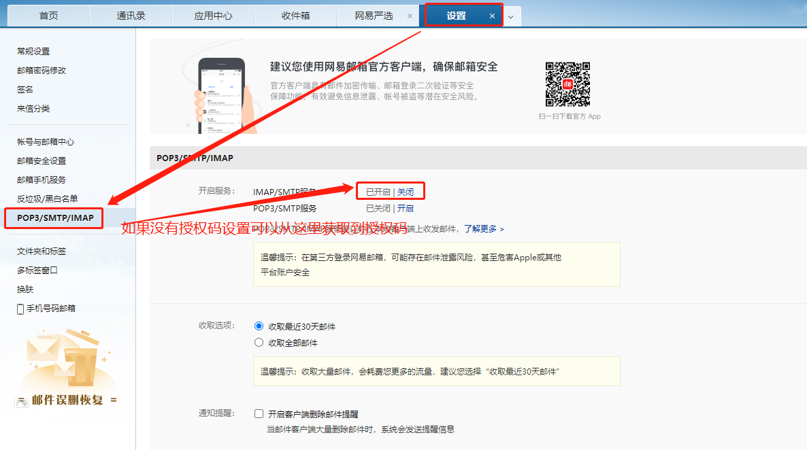

# Spring-Boot+RabbitMQ，保证消息100%投递成功并被消费
[原文链接](https://www.jianshu.com/p/dca01aad6bc8)
```text
涵盖知识点：
1. RabbitMQ消息发送确认机制
2. 消费确认机制
3. 消息的重新投递
4. 消费的幂等性，等等
```

## 一、实现思路
1. 简略介绍163邮箱授权码的获取
2. 编写发送邮件工具类
3. 编写RabbitMQ配置文件
4. 生成者发起调用
5. 消费者发送邮件
6. 定时任务定时拉取投递失败的消息，重新投递
7. 各种异常情况的测试验证
8. 扩展：使用动态代理实现消费端幂等性验证和消息确认(ack)

## 二、代码实现
1. 163邮箱授权码获取，登录邮箱-》设置-》常规设置-》客户端授权码密码-》开启


        该授权码就是配置文件 spring.mail.password 需要的密码

2. `pom.xml`
    ```xml
    <!--mq-->
    <dependency>
        <groupId>org.springframework.boot</groupId>
        <artifactId>spring-boot-starter-amqp</artifactId>
    </dependency>
    <!--mail-->
    <dependency>
        <groupId>org.springframework.boot</groupId>
        <artifactId>spring-boot-starter-mail</artifactId>
    </dependency>
    ```
3. `rabbitmq`、邮箱配置    
    ```properties
    # rabbitmq
    spring.rabbitmq.host=localhost
    spring.rabbitmq.port=5672
    spring.rabbitmq.username=guest
    spring.rabbitmq.password=guest
    # 开启confirms回调 P -> Exchange
    spring.rabbitmq.publisher-confirms=true
    # 开启returnedMessage回调 Exchange -> Queue
    spring.rabbitmq.publisher-returns=true
    # 设置手动确认(ack) Queue -> C
    spring.rabbitmq.listener.simple.acknowledge-mode=manual
    spring.rabbitmq.listener.simple.prefetch=100
    
    # mail  password即授权码，username和from要一致
    spring.mail.host=smtp.163.com
    spring.mail.username=186****2249@163.com
    spring.mail.password=***
    spring.mail.from=186****2249@163.com
    spring.mail.properties.mail.smtp.auth=true
    spring.mail.properties.mail.smtp.starttls.enable=true
    spring.mail.properties.mail.smtp.starttls.required=true
    ```
4. 表结构
    ```sql
   -- exchange routing_key 字段是在定时任务重新投递消息时需要用到
    CREATE TABLE `msg_log` (
      `msg_id` varchar(255) NOT NULL DEFAULT '' COMMENT '消息唯一标识',
      `msg` text COMMENT '消息体, json格式化',
      `exchange` varchar(255) NOT NULL DEFAULT '' COMMENT '交换机',
      `routing_key` varchar(255) NOT NULL DEFAULT '' COMMENT '路由键',
      `status` int(11) NOT NULL DEFAULT '0' COMMENT '状态: 0投递中 1投递成功 2投递失败 3已消费',
      `try_count` int(11) NOT NULL DEFAULT '0' COMMENT '重试次数',
      `next_try_time` datetime DEFAULT NULL COMMENT '下一次重试时间',
      `create_time` datetime DEFAULT NULL COMMENT '创建时间',
      `update_time` datetime DEFAULT NULL COMMENT '更新时间',
      PRIMARY KEY (`msg_id`),
      UNIQUE KEY `unq_msg_id` (`msg_id`) USING BTREE
    ) ENGINE=InnoDB DEFAULT CHARSET=utf8mb4 COMMENT='消息投递日志';
    ```
5. MailUtil
    ```java
    @Component
    @Slf4j
    public class MailUtil {
    
        @Value("${spring.mail.from}")
        private String from;
    
        @Autowired
        private JavaMailSender mailSender;
    
        /**
         * 发送简单邮件
         *
         * @param mail
         */
        public boolean send(Mail mail) {
            String to = mail.getTo();// 目标邮箱
            String title = mail.getTitle();// 邮件标题
            String content = mail.getContent();// 邮件正文
    
            SimpleMailMessage message = new SimpleMailMessage();
            message.setFrom(from);
            message.setTo(to);
            message.setSubject(title);
            message.setText(content);
    
            try {
                mailSender.send(message);
                log.info("邮件发送成功");
                return true;
            } catch (MailException e) {
                log.error("邮件发送失败, to: {}, title: {}", to, title, e);
                return false;
            }
        }
    
    }
    ```
6. RabbitConfig
    ```java
    @Configuration
    @Slf4j
    public class RabbitConfig {
    
        @Autowired
        private CachingConnectionFactory connectionFactory;
    
        @Autowired
        private MsgLogService msgLogService;
    
        @Bean
        public RabbitTemplate rabbitTemplate() {
            RabbitTemplate rabbitTemplate = new RabbitTemplate(connectionFactory);
            rabbitTemplate.setMessageConverter(converter());
    
            // 消息是否成功发送到Exchange
            rabbitTemplate.setConfirmCallback((correlationData, ack, cause) -> {
                if (ack) {
                    log.info("消息成功发送到Exchange");
                    String msgId = correlationData.getId();
                    msgLogService.updateStatus(msgId, Constant.MsgLogStatus.DELIVER_SUCCESS);
                } else {
                    log.info("消息发送到Exchange失败, {}, cause: {}", correlationData, cause);
                }
            });
    
            // 触发setReturnCallback回调必须设置mandatory=true, 否则Exchange没有找到Queue就会丢弃掉消息, 而不会触发回调
            rabbitTemplate.setMandatory(true);
            // 消息是否从Exchange路由到Queue, 注意: 这是一个失败回调, 只有消息从Exchange路由到Queue失败才会回调这个方法
            rabbitTemplate.setReturnCallback((message, replyCode, replyText, exchange, routingKey) -> {
                log.info("消息从Exchange路由到Queue失败: exchange: {}, route: {}, replyCode: {}, replyText: {}, message: {}", exchange, routingKey, replyCode, replyText, message);
            });
    
            return rabbitTemplate;
        }
    
        @Bean
        public Jackson2JsonMessageConverter converter() {
            return new Jackson2JsonMessageConverter();
        }
    
        // 发送邮件
        public static final String MAIL_QUEUE_NAME = "mail.queue";
        public static final String MAIL_EXCHANGE_NAME = "mail.exchange";
        public static final String MAIL_ROUTING_KEY_NAME = "mail.routing.key";
    
        @Bean
        public Queue mailQueue() {
            return new Queue(MAIL_QUEUE_NAME, true);
        }
    
        @Bean
        public DirectExchange mailExchange() {
            return new DirectExchange(MAIL_EXCHANGE_NAME, true, false);
        }
    
        @Bean
        public Binding mailBinding() {
            return BindingBuilder.bind(mailQueue()).to(mailExchange()).with(MAIL_ROUTING_KEY_NAME);
        }
    
    }
    ```
7. TestServiceImpl 生产消息
    ```java
    @Service
    public class TestServiceImpl implements TestService {
    
        @Autowired
        private MsgLogMapper msgLogMapper;
    
        @Autowired
        private RabbitTemplate rabbitTemplate;
    
        @Override
        public ServerResponse send(Mail mail) {
            String msgId = RandomUtil.UUID32();
            mail.setMsgId(msgId);
    
            MsgLog msgLog = new MsgLog(msgId, mail, RabbitConfig.MAIL_EXCHANGE_NAME, RabbitConfig.MAIL_ROUTING_KEY_NAME);
            msgLogMapper.insert(msgLog);// 消息入库
    
            CorrelationData correlationData = new CorrelationData(msgId);
            rabbitTemplate.convertAndSend(RabbitConfig.MAIL_EXCHANGE_NAME, RabbitConfig.MAIL_ROUTING_KEY_NAME, MessageHelper.objToMsg(mail), correlationData);// 发送消息
    
            return ServerResponse.success(ResponseCode.MAIL_SEND_SUCCESS.getMsg());
        }
    
    }
    ```
8. `MailConsumer`消费消息，发送邮件  
    其实就完成了3件事：1.保证消息幂等性，2.发送邮件，3.更新消息状态，手动ack
    ```java
    @Component
    @Slf4j
    public class MailConsumer {
    
        @Autowired
        private MsgLogService msgLogService;
    
        @Autowired
        private MailUtil mailUtil;
    
        @RabbitListener(queues = RabbitConfig.MAIL_QUEUE_NAME)
        public void consume(Message message, Channel channel) throws IOException {
            Mail mail = MessageHelper.msgToObj(message, Mail.class);
            log.info("收到消息: {}", mail.toString());
    
            String msgId = mail.getMsgId();
    
            MsgLog msgLog = msgLogService.selectByMsgId(msgId);
            if (null == msgLog || msgLog.getStatus().equals(Constant.MsgLogStatus.CONSUMED_SUCCESS)) {// 消费幂等性
                log.info("重复消费, msgId: {}", msgId);
                return;
            }
    
            MessageProperties properties = message.getMessageProperties();
            long tag = properties.getDeliveryTag();
    
            boolean success = mailUtil.send(mail);
            if (success) {
                msgLogService.updateStatus(msgId, Constant.MsgLogStatus.CONSUMED_SUCCESS);
                channel.basicAck(tag, false);// 消费确认
            } else {
                channel.basicNack(tag, false, true);
            }
        }
    
    }
    ```
9. `ResendMsg`定时任务重新投递发送失败的消息   
    每一条消息都和exchange routingKey绑定，所有消息重投共用这一个定时任务即可   
    ```java
    @Component
    @Slf4j
    public class ResendMsg {
    
        @Autowired
        private MsgLogService msgLogService;
    
        @Autowired
        private RabbitTemplate rabbitTemplate;
    
        // 最大投递次数
        private static final int MAX_TRY_COUNT = 3;
    
        /**
         * 每30s拉取投递失败的消息, 重新投递
         */
        @Scheduled(cron = "0/30 * * * * ?")
        public void resend() {
            log.info("开始执行定时任务(重新投递消息)");
    
            List<MsgLog> msgLogs = msgLogService.selectTimeoutMsg();
            msgLogs.forEach(msgLog -> {
                String msgId = msgLog.getMsgId();
                if (msgLog.getTryCount() >= MAX_TRY_COUNT) {
                    msgLogService.updateStatus(msgId, Constant.MsgLogStatus.DELIVER_FAIL);
                    log.info("超过最大重试次数, 消息投递失败, msgId: {}", msgId);
                } else {
                    msgLogService.updateTryCount(msgId, msgLog.getNextTryTime());// 投递次数+1
    
                    CorrelationData correlationData = new CorrelationData(msgId);
                    rabbitTemplate.convertAndSend(msgLog.getExchange(), msgLog.getRoutingKey(), MessageHelper.objToMsg(msgLog.getMsg()), correlationData);// 重新投递
    
                    log.info("第 " + (msgLog.getTryCount() + 1) + " 次重新投递消息");
                }
            });
    
            log.info("定时任务执行结束(重新投递消息)");
        }
    
    }
    ```